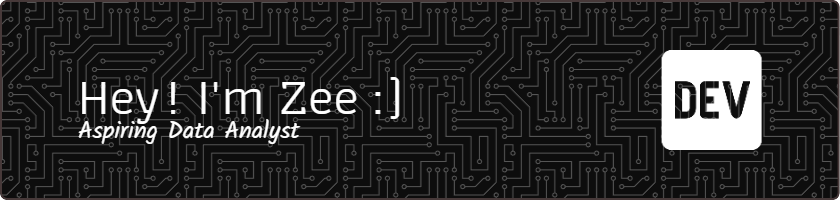

# Muhammad Zubair 👋

## Little bit about me:

Before joining App Academy, I worked as an insurance service representative, finding fulfillment in providing assurance to customers but feeling a sense of passionless fulfillment. This led to self-discovery and a rediscovery of my passion for software engineering, eventually leading me to App Academy. I've since undergone significant personal growth, recognizing technical strengths such as debugging, communication, and teamwork, alongside non-technical strengths like passion for software development and accountability. I find debugging particularly enjoyable due to its requirement for patience, persistence, and deep knowledge. I value level-headed teamwork in others, aligning with my own persistence. As someone who enjoys volunteer work, I seek opportunities to connect with like-minded individuals in local charities and non-profit organizations. My professional narrative combines diverse experiences as a senior insurance service representative and a mechanic shop foreman, where I developed strong problem-solving, communication, and leadership skills, now leveraged in software engineering to drive innovation and hopefully make a meaningful impact.                                                                                                                                                                                                                                                   
## Welcome! 

- 🔭 I’m currently working on adding features to a clone of Amazon (Amazonia)
- 🌱 I’m currently learning C#
- 👯 I’m looking to collaborate on creating full stack web application for blue collar businesses.
- 📫 How to reach me:   

## Skills  
| Category        | Skills        |
|-----------------|---------------|
| Frameworks|       
| Hosting/SaaS |  
| Databases | 	   |
| Languages |   
| Learning |         |

## Thanks for stopping by!
If you wanted more information about me heres a link to my [resume](https://docs.google.com/document/d/1gRw5rrvjT5uUdQZOy0kycEEgC_ewIrvo-8PZG4x3O9M/edit)

<!--
**mzubair4193/mzubair4193** is a ✨ _special_ ✨ repository because its `README.md` (this file) appears on your GitHub profile.

Here are some ideas to get you started:

-->
